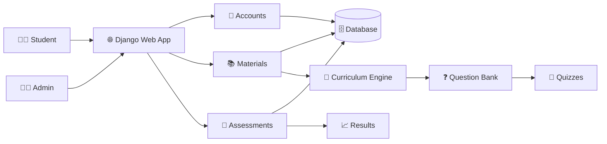

<div align="center">


<a href="https://github.com/RICK2814/SSNC"></a>

<p></p>
<p></p>
<p><a href="https://ssnc-8qqp.onrender.com/"></a></p>
</div>

---

## 🌐 About Siksha Sahayak

**Siksha Sahayak** is a full-stack Django-based digital learning and assessment platform created to bring **curriculum, study materials, question banks, practice and quizzes** into one structured learning ecosystem.

### 🚀 Live Application

🔗 **Live Website:** https://ssnc-8qqp.onrender.com/

### 🎯 What the platform does

| Area | What it provides |
|---|---|
| 📚 **Learning Content** | Subjects, class levels, chapters and structured study materials |
| ❓ **Question Bank** | Important topic-wise questions with answers and explanations |
| 🧠 **Quizzes** | Topic-based quizzes designed for active practice and assessment |
| 👨‍🎓 **Students** | Student profiles, learning workflows and assessment attempts |
| 🛡️ **Administration** | Django Admin for managing academic content and users |
| 🌱 **Curriculum Engine** | Automated seeding of structured academic resources |
| 📊 **Assessment** | Practice attempts, quiz attempts and performance-oriented workflows |

### 🔄 Learning Experience

<div align="center"></div>

## ⚡ What is Siksha Sahayak?

**Siksha Sahayak** is a Django-based digital learning and assessment platform designed to organize curriculum, study materials, question banks, quizzes, student accounts and assessment workflows in one place.

## 🧠 Core Modules

| Module | Purpose |
|---|---|
| 👤 **Accounts** | Student profiles, authentication and user management |
| 📚 **Materials** | Subjects, class levels, chapters and study materials |
| ❓ **Assessments** | Question bank, quizzes, practice attempts and quiz attempts |
| 🛡️ **Admin** | Django admin interface for academic content |
| 🌱 **Curriculum Seeder** | Automated population of structured academic content |

## 🚀 Advanced Curriculum Engine

<div align="center"></div>

- 📘 Structured subjects and class levels
- 📖 Advanced topic-wise study material
- ❓ Important question-bank entries
- 🧠 20-question quizzes per topic
- 🎚️ Difficulty levels
- 💡 Answer explanations
- ⏱️ Configurable quiz timing
- 🛠️ Django admin management

## 📊 Platform Architecture



## ✨ Feature Matrix

| Feature | Status |
|:---:|:---:|
| 🔐 Authentication & authorization | ✅ |
| 👨‍🎓 Student profiles | ✅ |
| 🏫 Class levels | ✅ |
| 📚 Subjects & chapters | ✅ |
| 📖 Study materials | ✅ |
| ❓ Question bank | ✅ |
| 🧠 Topic quizzes | ✅ |
| 🎯 Practice attempts | ✅ |
| 📊 Quiz results | ✅ |
| 🛠️ Django admin | ✅ |
| 🌱 Curriculum seeding | ✅ |

## 🛠️ Technology Stack

<div align="center"></div>

## 📁 Project Structure

<div align="center"></div>

## ⚙️ Local Setup

<div align="center"></div>

### 🪟 Windows PowerShell — Animated & Copy-Ready

<div align="center"></div>

**📋 Copy the commands directly from this block:**

```powershell
# Clone the repository
git clone https://github.com/RICK2814/SSNC.git
cd SSNC

# Create and activate virtual environment
python -m venv .venv
.venv\Scripts\activate
```

### 📦 Install and initialize — Copy Ready

<div align="center"></div>

**📋 Copy the full setup sequence:**

```powershell
pip install -r requirements.txt
python manage.py migrate
python manage.py createsuperuser
python manage.py seed_curriculum
python manage.py runserver
```

### 🌐 Open the application

```text
http://127.0.0.1:8000/
```

### 🛡️ Open Django Admin

```text
http://127.0.0.1:8000/admin/
```

## 🌱 Curriculum Seeder

```bash
python manage.py seed_curriculum
```

## 🔐 Production Security Checklist

- [ ] `DEBUG=False`
- [ ] `SECRET_KEY` stored in an environment variable
- [ ] `ALLOWED_HOSTS` configured
- [ ] Production database configured
- [ ] Static/media storage configured
- [ ] `.env` and credentials excluded from Git
- [ ] `python manage.py check --deploy`

## ☁️ Deployment

**Build**

```bash
pip install -r requirements.txt && python manage.py collectstatic --noinput && python manage.py migrate
```

**Start**

```bash
gunicorn siksha_sahayak.wsgi:application
```

## 🗺️ Roadmap

<div align="center"></div>

### Roadmap Status

- [x] Django academic foundation
- [x] Accounts and student profiles
- [x] Subjects and class levels
- [x] Chapters and topics
- [x] Study materials
- [x] Question bank
- [x] Topic quizzes
- [x] Practice and quiz attempts
- [x] Curriculum seeding
- [ ] Student analytics dashboard
- [ ] Progress visualization
- [ ] Personalized recommendations
- [ ] Advanced search
- [ ] Mobile API
- [ ] Gamification

## 🤝 Contributing

```bash
git checkout -b feature/your-feature
git add .
git commit -m "Add your feature"
git push origin feature/your-feature
```

Then open a Pull Request.

## 📄 License

This project is distributed under the repository's **MIT License**.

<div align="center"></div>
