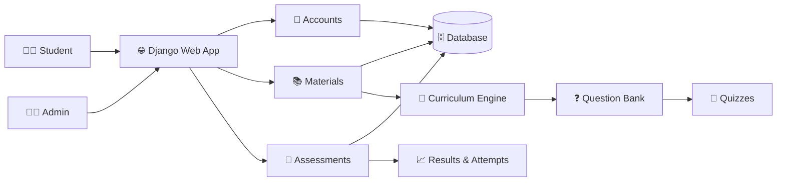

<div align="center">

<!-- 🌌 Animated Hero -->
<a href="https://github.com/RICK2814/SSNC">
  
</a>

<a href="https://github.com/RICK2814/SSNC">
  
</a>

<p>
  
  
  
  
  
</p>

<p>
  
  
  
  
</p>

</div>

---

## ⚡ What is Siksha Sahayak?

**Siksha Sahayak** is a Django-based digital learning and assessment platform designed to organize curriculum, study materials, question banks, quizzes, student accounts and assessment workflows in one place.

The project is structured around a simple learning loop:

```text
┌──────────────┐    ┌──────────────┐    ┌──────────────┐    ┌──────────────┐
│   CURRICULUM │ ─▶ │   MATERIALS  │ ─▶ │   PRACTICE   │ ─▶ │  ASSESSMENT  │
│ Subjects     │    │ Chapters     │    │ Question Bank│    │ Quizzes      │
│ Class Levels │    │ Study Notes  │    │ Explanations │    │ Attempts     │
└──────────────┘    └──────────────┘    └──────────────┘    └──────────────┘
          ▲                                                        │
          └────────────────────── RESULTS ◀────────────────────────┘
```

---

## 🧠 Core Modules

| Module | Purpose |
|---|---|
| 👤 **Accounts** | Student profiles, authentication and user management |
| 📚 **Materials** | Subjects, class levels, chapters and study materials |
| ❓ **Assessments** | Question bank, quizzes, practice attempts and quiz attempts |
| 🛡️ **Admin** | Django admin interface for managing academic content |
| 🧪 **Curriculum Seeder** | Automated population of structured academic content |
| 🎯 **Learning Flow** | Study → practice → quiz → review |

---

## 🚀 Advanced Curriculum Engine

The curriculum is designed so content can scale across classes and subjects without manually rebuilding the application structure.

### Content hierarchy

```text
CLASS LEVEL
    │
    ├── SUBJECT
    │      │
    │      ├── CHAPTER / TOPIC
    │      │      │
    │      │      ├── 📖 Advanced Study Material
    │      │      ├── ❓ Question Bank
    │      │      └── 🧠 20-Question Quiz
    │      │
    │      └── ...
    │
    └── ...
```

### Current seeded learning model

- 📘 Structured subjects and class levels
- 📖 Advanced topic-wise study material
- ❓ Important question-bank entries
- 🧠 **20-question quizzes per topic**
- 🎚️ Difficulty levels for questions
- 💡 Answer explanations
- ⏱️ Configurable quiz timing
- 🛠️ Django admin management

---

## 📊 Platform Architecture



---

## ✨ Feature Matrix

<div align="center">

| Feature | Status |
|:---:|:---:|
| 🔐 Authentication & authorization | ✅ |
| 👨‍🎓 Student profiles | ✅ |
| 🏫 Class levels | ✅ |
| 📚 Subjects & chapters | ✅ |
| 📖 Study materials | ✅ |
| ❓ Question bank | ✅ |
| 🧠 Topic quizzes | ✅ |
| 🎯 Practice attempts | ✅ |
| 📊 Quiz attempts / results | ✅ |
| 🛠️ Django admin | ✅ |
| 🌱 Automated curriculum seeding | ✅ |
| 📱 Responsive UI foundation | ✅ |

</div>

---

## 🛠️ Technology Stack

<div align="center">


</div>

---

## 📁 Project Structure

```text
SSNC/
├── accounts/                 # User and student account functionality
├── assessments/             # Questions, quizzes and attempts
├── materials/               # Subjects, chapters and study content
├── siksha_sahayak/           # Django project configuration
├── static/                   # Static assets
├── templates/                # HTML templates
├── CURRICULUM_SETUP.md       # Curriculum setup guide
├── build.sh                 # Deployment/build helper
├── manage.py                 # Django management entry point
├── requirements.txt         # Python dependencies
├── .gitignore
└── README.md
```

---

## ⚙️ Local Setup

### 1. Clone

```bash
git clone https://github.com/RICK2814/SSNC.git
cd SSNC
```

### 2. Create a virtual environment

**Windows PowerShell**

```powershell
py -3.13 -m venv .venv
.venv\Scripts\activate
```

**macOS / Linux**

```bash
python3 -m venv .venv
source .venv/bin/activate
```

### 3. Install dependencies

```bash
pip install -r requirements.txt
```

### 4. Apply migrations

```bash
python manage.py migrate
```

### 5. Create the admin account

```bash
python manage.py createsuperuser
```

### 6. Seed the curriculum

```bash
python manage.py seed_curriculum
```

### 7. Run the application

```bash
python manage.py runserver
```

Open:

```text
http://127.0.0.1:8000/
```

Admin:

```text
http://127.0.0.1:8000/admin/
```

---

## 🧪 Curriculum Seeder

The project includes an automated curriculum population command:

```bash
python manage.py seed_curriculum
```

It is intended to generate the structured academic hierarchy, study materials, question-bank content and quizzes used by the application.

> **Tip:** Run the seeder once on a fresh database and verify the generated records in Django Admin before running it again.

---

## 🔐 Production Security Checklist

Before deployment:

- [ ] Set `DEBUG=False`
- [ ] Move `SECRET_KEY` into an environment variable
- [ ] Configure `ALLOWED_HOSTS`
- [ ] Use PostgreSQL or another production database
- [ ] Configure static-file serving
- [ ] Configure media/file storage if required
- [ ] Never commit `.env`, credentials or database secrets
- [ ] Run `python manage.py check --deploy`

Example environment variables:

```env
SECRET_KEY=replace-with-a-secure-production-secret
DEBUG=False
ALLOWED_HOSTS=your-domain.example.com
DATABASE_URL=your-production-database-url
```

---

## ☁️ Deployment

The project can be deployed on platforms that support Django/WGI applications.

Typical production commands:

```bash
pip install -r requirements.txt
python manage.py collectstatic --noinput
python manage.py migrate
gunicorn siksha_sahayak.wsgi:application
```

For Render-style deployment, the build/start configuration can be:

**Build**

```bash
pip install -r requirements.txt && python manage.py collectstatic --noinput && python manage.py migrate
```

**Start**

```bash
gunicorn siksha_sahayak.wsgi:application
```

---

## 🎯 Why this project?

Siksha Sahayak is built around a practical idea: **learning content should lead directly to measurable practice and assessment.** Instead of keeping notes, questions and quizzes disconnected, the platform links them through the same class → subject → topic hierarchy.

```text
                 ┌─────────────────────┐
                 │     LEARN SMART     │
                 └──────────┬──────────┘
                            ▼
                  📖 Study Material
                            │
                            ▼
                     ❓ Practice
                            │
                            ▼
                      🧠 Quiz
                            │
                            ▼
                    📊 Performance
                            │
                            ▼
                    🎯 Improve Skills
                            │
                            └───────────────↺
```

---

## 🌟 Roadmap

- [x] Django academic foundation
- [x] Accounts and student profiles
- [x] Subjects and class levels
- [x] Chapter/topic organization
- [x] Study materials
- [x] Question bank
- [x] Topic quizzes
- [x] Practice and quiz attempts
- [x] Automated curriculum seeding
- [ ] Rich student analytics dashboard
- [ ] Progress visualization
- [ ] Personalized learning recommendations
- [ ] Advanced search and filtering
- [ ] API layer for mobile clients
- [ ] Gamification / badges / streaks

---

## 🤝 Contributing

Contributions are welcome.

```bash
git checkout -b feature/your-feature
git add .
git commit -m "Add your feature"
git push origin feature/your-feature
```

Then open a Pull Request on GitHub.

---

## 📄 License

This project is distributed under the repository's **MIT License**.

---

<div align="center">

### ⚡ Built to make learning more structured, measurable and accessible.


<a href="https://github.com/RICK2814/SSNC">
  
</a>

</div>
